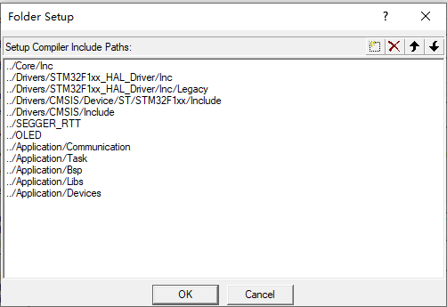
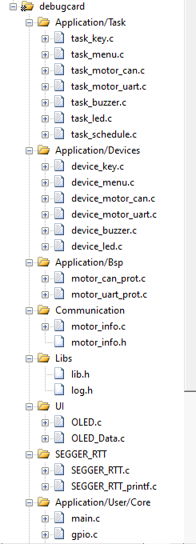
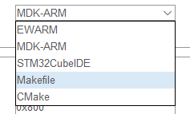
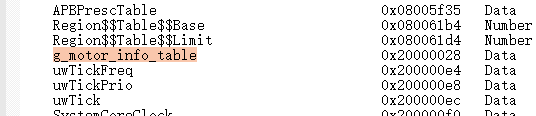
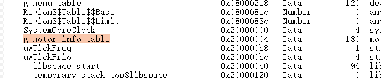

# DDT simple motor test fitting board

-   achieve control of all models of our prototype motors

motor models currently supported:

|      Type      | communication |
| :------------: | :-----------: |
| M0601C_111/411 |     RS485     |
|   M0602C_112   |     RS485     |
| M0603C_111/211 |     uart      |
|   M1502E_111   |      CAN      |
| M1502D_133/233 |      CAN      |
|   M1505A_222   |      CAN      |
| P1010A/P1010B  |      CAN      |
| M0603A_111/411 |      LIN      |

-   key + OLED UI page display
    1.  In the first-level page, the user through the button to select the motor model, press the"OK" key to enter the second-level page
    2.  Second-level page display motor real-time speed, temperature and other information
    3.  Switch Speed (10% speed is adjustable)

# How to compile?

## ARM-MDK

You can use the stm32cubemx software (double-click the  file debugcard.ioc) to develop your project


You can use an ARM-MDK integrated development environment or a makefile (using the GCC build tool chain) 

If you are using ARM-MDK, you need to add a header file containing the path in the software, as shown below



The structure of the project should be like this



## GCC

you also can using the GCC build tool chain



# project compile development tips

This project se STM32CubeMX graphical configuration tool to configure peripherals and generate HAL library C language code，uses the KEIL5 MDK-ARM integrated development environment. Here are the tools I use. If your configuration is different from mine, it may cause build failures and errors

## Keil arm compiler6

KEIL5 arm compiler6 compiler compared to the V5 version greatly reduced the project compilation time

So I configured the AC6 compiler in Keil MDK, you can learn about Keil v 6 compiler performance optimization and considerations

## keil-build-viewer

This is an open source Keil build information display enhancement tool, please see https://gitee.com/DinoHaw/keil-build-viewer

## Jlink Burn and debug

I use the Jlink debugger and use the SEGGER RTT  with the J-Link RTT Viewer software to print out the debug log, but you can use other debuggers as well, you just can't print a log using Segger RTT

# project folders explain

|    file     |                           explain                            |
| :---------: | :----------------------------------------------------------: |
| Application | User code folders, including Board Support packages (packaged as devices) , custom macros, and task scheduling related |
|    OLED     |                  OLED screen driver library                  |
| SEGGER_RTT  | The RTT tool, used by J-Link RTT Viewer software, is used to print logs for easy debugging |

# debug problem record

## The HardFault that is raised when an array address crosses the bounds

When I didn't change the code, just changed it from Keil Arm compiler v5 to Keil Arm compiler V6(because the V6 version compiled several times faster) , my code crashed and went into `HardFault`

I found the code in question

```
OLED_ShowString(10, 15, g_motor_info_table[(g_menu_device.motor_index - 1) % MOTOR_ID_COUNT].name, OLED_6X8);        
```

The `g_motor_info_table` variable is an array of global structures that I defined elsewhere

```
motor_info_table_t g_motor_info_table[MOTOR_ID_COUNT];
```

The crux of the matter is `g_menu_device.motor_index` this variable ,`g_menu_device.motor_index` this variable ,I gave zero the initial value when I initialized it

So when I subtract it`g_menu_device.motor_index` by one `g_motor_info_table[(g_menu_device.motor_index - 1)`and use that as a subscript to access the array, the memory will naturally overflow, but what I want to explore is why the same code works perfectly with the V5 compiler, the V6 compiler can not

### Look at the distribution of compiled program memory

-    Keil Arm compiler v5:



-    Keil Arm compiler v6:



-   Analysis:

In the STM32 Cortex-M4 microcontroller, RAM (including SRAM and other types of RAM) is mapped into the memory address space, and the internal SRAM of the STM32F4 series microcontroller starts at address 0x2000000

Look at the picture above,In the Arm compiler V 6,variable`g_menu_device.motor_index`the address is `0x20000004`,So when the array address overflows up and is below `0x20000000`, the access to the invalid address results in a `HardFault`

## RS485 communication direction pin control

BL3085N is a half-duplex RS-485 transceiver. A GPIO pin is drawn from the MCU to manually control the direction of communication of the transceiver. When the GPIO outputs a high level, RS-485 is the direction of transmission, that is, the MCU sends data to the bus, when GPIO output is low, RS -485 is the receiving direction, that is, MCU receives the data on the bus

In the code, I write this:

```
// set the rs485 communication direction to send
HAL_GPIO_WritePin(RS485_DIR_GPIO_Port, RS485_DIR_Pin, GPIO_PIN_SET);
// send the data to the motor
HAL_UART_Transmit(huart, buff, (uint16_t)AGT_UART_BUFF_LEN,0xffff);
// set the rs485 communication direction to receive
HAL_GPIO_WritePin(RS485_DIR_GPIO_Port, RS485_DIR_Pin, GPIO_PIN_RESET);
```

Note that I did not add a HAL delay because the motor replies to data very quickly. If you add a delay after the switch level (for example, 20ms) , this will cause the 485 transceiver can not be switched to receive mode in time, MCU lost received motor feedback byte data

## Modify the serial baud rate

​	When using UART communication to control M0603C and M0603A motors, because the baud rate of the two motors is not the same, we need to modify the baud rate of the corresponding serial port peripherals and reinitialize it after the user selects the motor model, this allows a serial port peripheral to support motors with different baud rates

## Motor CAN terminal resistance

​	When I support the motor model M1502E in the debugging process, the 120 terminal ohm resistor on the CAN bus of the motor is disconnected by default, and the terminal resistor of the control board is also disconnected, so the communication fails, the motor is out of control

​	In order to ensure the normal communication in the back, I turned on the CAN bus 120 ohms resistor on the control board (using the dial switch to select, please see the control board schematic for details) , and in the motor initialization time sends the instruction to open the motor terminal resistance, thus can stabilize the communication, and the successful control motor

